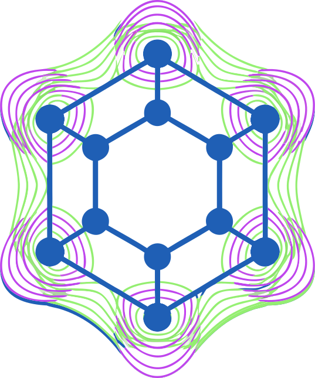

<p align="center">
  
</p>

# 🔬 CrystalCanvas

**High-performance crystal structure modeling, slab cleaving, and DFT/MD file preparation — in a native desktop app.**

CrystalCanvas is an open-source desktop GUI application designed for computational materials science, condensed matter physics, and quantum chemistry. It breaks free from the limitations of traditional tools (VESTA, Materials Studio) by combining a native-first architecture with modern AI-powered workflows.

---

## ✨ Key Features

- **🖱️ Pixel-precise manual modeling** — Hardware-accelerated 3D view with real-time atom selection, addition, deletion, and element substitution.
- **⚙️ Industrial-grade physics kernel** — C++ engine with Spglib (space group analysis), Eigen (matrix transforms), and Gemmi (CIF/PDB parsing).
- **🧠 AI-powered workflow** *(experimental)* — Natural language commands like *"Generate a 3×3×3 silicon supercell and dope 5% phosphorus on the surface"*. Context-aware LLM acts as a semantic parameterizer and command orchestrator with strict physics validation (MIC overlap checks).
- [🔌 **Seamless DFT/MD integration**](docs/knowledge/M7_Linker_IO_Learnings.md) — Native high-fidelity export for VASP (POSCAR), LAMMPS (Data), Quantum ESPRESSO (Input with automatic K-point density and IUPAC 2021 masses).
- **🛡️ Memory-safe architecture** — Rust logic layer eliminates crashes from dangling pointers and buffer overflows.

---

## 🏗️ Architecture

```
┌─────────────────────────────────────────────────────┐
│  React + TypeScript + TailwindCSS  (UI)             │
├─────────────────────────────────────────────────────┤
│  Rust / Tauri 2.0  (Application Logic / SSoT)       │
├─────────────────────────────────────────────────────┤
│  Rust / wgpu  (Rendering: Impostor Sphere)          │
├─────────────────────────────────────────────────────┤
│  C++ Physics Kernel  (Spglib / Gemmi / Eigen)       │
└─────────────────────────────────────────────────────┘
```

| Layer | Technology | Role |
|---|---|---|
| **Presentation** | React + TailwindCSS | UI panels, toolbars, chat |
| **Application** | Rust / Tauri 2.0 | State management, IPC, I/O pipeline |
| **Rendering** | Rust / wgpu | GPU-accelerated 3D (Metal / Vulkan / DX12) |
| **Compute** | C++ (Spglib, Gemmi, Eigen) | Symmetry, Overlap Detection, MIC |
| **FFI Bridge** | `cxx` (Rust ↔ C++) | Type-safe, zero-copy data transfer |

---

## 🚀 Getting Started

CrystalCanvas utilizes a **Zero-Global-Pollution** strategy. All toolchains (Rust, Node) and dependencies are isolated within the project directory.

### 1. Prerequisites (macOS)
- **Xcode Command Line Tools**: `xcode-select --install`
- **pnpm**: `npm install -g pnpm` (the only global dependency required)

### 2. Initial Setup
Clone the repository and initialize the local toolchains:

```bash
git clone https://github.com/XiaoJiang-Phy/CrystalCanvas.git
cd CrystalCanvas

# Initialize local Rustup and Cargo home
mkdir -p .rustup .cargo
source dev_env.sh

# Install Rust stable locally (if not present)
rustup toolchain install stable

# Install Node dependencies
pnpm install
```

### 3. Build & Run

CrystalCanvas handles C++/Rust/TS full-stack compilation in a unified flow.

#### Activation
Always source the environment script before starting development to ensure `RUSTUP_HOME` and `CARGO_HOME` point to the project-local folders:
```bash
source dev_env.sh
```

#### Run in Development Mode
```bash
# This starts the Vite dev server and the Tauri native window
pnpm run tauri dev
```

#### Run Standalone Rendering Demo
To verify GPU/wgpu compatibility without the full React UI:
```bash
cd src-tauri
RUST_LOG=info cargo run --bin render_demo
```
*Controls: Left-click drag to rotate, scroll to zoom.*

> **Note**: The C++ kernel (Spglib, Gemmi, Eigen) is compiled automatically via the Rust `build.rs` script using `cxx-build`. No manual CMake interaction is required.

---

## 🗺️ Roadmap & Progress

- [x] **M1-M2: Infrastructure & Data Model** — Rust/C++ bridge, CIF parsing.
- [x] **M3: High-Performance Rendering (wgpu)** — Impostor spheres, ray-picking, orbital camera.
- [x] **M4-M6: UI Integration & Geometry Ops** — Hybrid window, slab cleaving, supercells, atomic operations.
- [x] **M7-M8: DFT/MD Ecology & I/O Pipeline** — Overlap detection (MIC), native exporters (VASP, QE, LAMMPS).
- [x] **M8.5: Persistent Settings & UI Polish** — Local JSON caching, global rendering customization.
- [ ] **M9: LLM Command Bus** — Context-aware semantic AI agent for macro-scale geometry manipulation.
- [ ] **M10: Structural Analysis & Phonons** — Polyhedra identification, defect tracking, and imaginary frequency animation.
- [ ] **M11: Volumetric & Magnetic States** — Real-time Compute Shader isosurfaces (CHGCAR) and non-collinear spin vectors.
- [ ] **M12+: AI4Science Phase Space** — High-throughput MLFF dataset perturbations, NEB playback, and Symmetry Subgroup extraction.

---

## 📁 Project Structure

```text
CrystalCanvas/
├── src-tauri/          # Rust backend (Tauri commands, state handling, wgpu layer)
│   ├── src/          # Rust core logic (State Manager, Command Router)
│   ├── build.rs        # Unified Rust + C++ build script (cmake crate)
│   └── Cargo.toml
├── src/                # React frontend (TypeScript + TailwindCSS components)
│   ├── components/
│   └── types/          # Strict TS IPC mappings (e.g., CrystalState, CrystalCommand)
├── cpp/                # C++ physics kernel
│   ├── include/        # Public C-compatible headers (cxx bridge)
│   ├── src/            # Implementation code (Spglib, Gemmi, Eigen integrations)
│   └── CMakeLists.txt
├── shaders/            # WGSL compute/render shader sources
├── docs/               # System documentation and knowledge base
├── dev_env.sh          # Local toolchain environment activation script
├── pnpm-lock.yaml      # Strict dependency lockfile
└── README.md
```

---

## 🤝 Contributing

Contributions are welcome! Please see [CONTRIBUTING.md](CONTRIBUTING.md) for guidelines.

### Development Notes

- **Primary dev platform**: macOS (Intel & Apple Silicon)
- **Environment toolchains** should be installed locally within the project directory when possible (see `.gitignore` for excluded paths).
- Internal docs (`roadmap.md`, `docs/`) are **not tracked in git** — they are local planning documents.

---

## 📄 License

This project is dual-licensed under the **MIT License** and the **Apache License 2.0**. You may choose either license for your use.

- [LICENSE-MIT](LICENSE-MIT)
- [LICENSE-APACHE](LICENSE-APACHE)

For third-party software licenses used in this project, please see [THIRD_PARTY_LICENSES.md](THIRD_PARTY_LICENSES.md).

---

## 🙏 Acknowledgments

- [Spglib](https://spglib.github.io/spglib/) — Crystal symmetry analysis
- [Gemmi](https://gemmi.readthedocs.io/) — CIF/PDB file parsing
- [Eigen](https://eigen.tuxfamily.org/) — Linear algebra
- [Tauri](https://tauri.app/) — Desktop app framework
- [wgpu](https://wgpu.rs/) — Cross-platform GPU API
